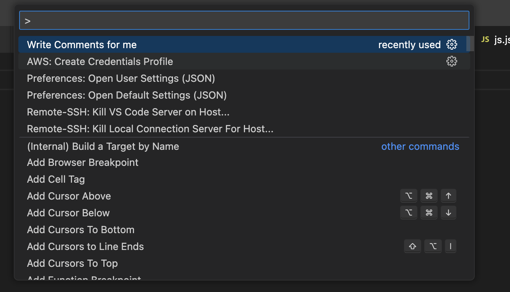
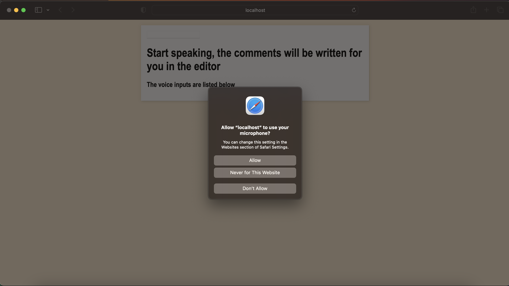
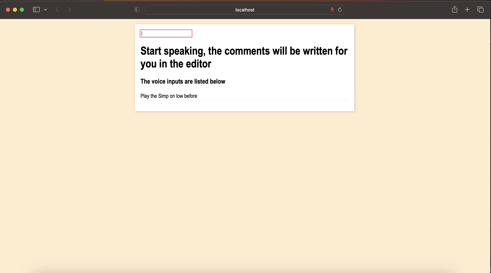
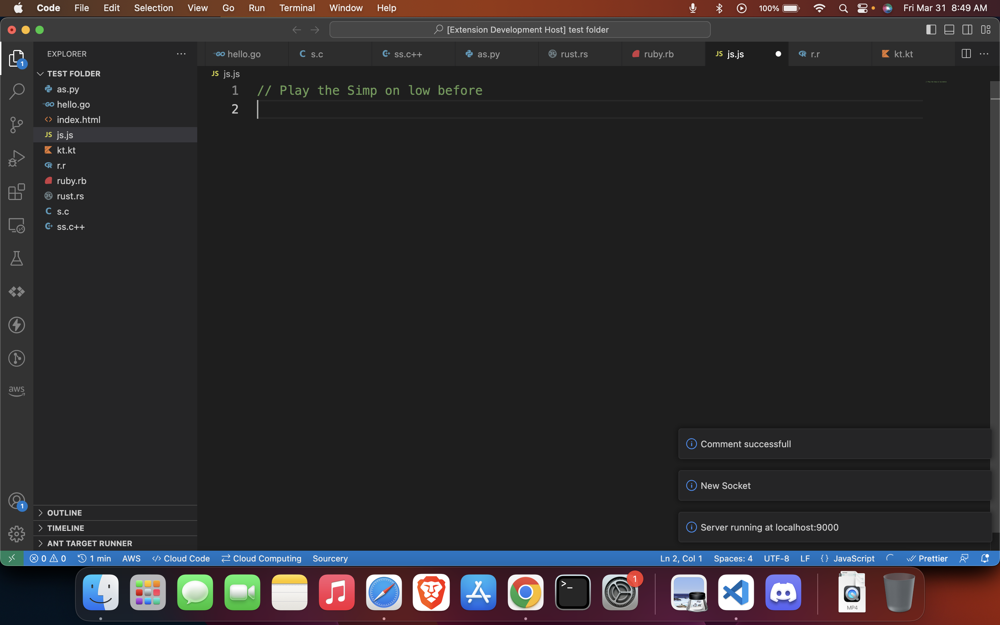

# speech-to-comment-extension README

An extension to make development easy by writing comments from speech input. This extension takes in voice speech input and writes down at the cursor pointed.

## Features

This extension makes use of the in built browser's Speech Recognition module to take in the speech inputs and then with the help of VS code api, convert the speech to text and write the comments to their respective language.

Describe specific features of your extension including screenshots of your extension in action. Image paths are relative to this README file.

For example if there is an image subfolder under your extension project workspace:

## Instructions

- Press CMD + SHIFT + P(Mac) or CTL + SHIFT + P(Windows) to bring out the panel to write the command.
- Type "Write Comments for me" in the panel to see the command and run it (As shown in the screenshot below)
  
- Once the command runs, it will open a default browser and ask for microphone permission (this extension does not intend or collect data) through which the extension can take the speech input and convert to text. (Below screenshot is an example)
  
- Speak near the microphone, the extension will automatically detect the input and the kind of file, and write the comments accordigly. (The screenshot below shoes the mic active with red mark)
  
- The output is show using the screenshot below
  

> Tip: Many popular extensions utilize animations. This is an excellent way to show off your extension! We recommend short, focused animations that are easy to follow.

## Requirements

If you are going to make changes to the repo.
first add the dependencies using `npm i`

## Programming Languages Supported

- Java
- JavaScript
- Python
- C
- C++
- Go
- Php
- Rust
- Ruby
- R
- Perl

## Release Notes

### 1.0.0

Initial release of extension.

---

## Credits

[Ole Kristian Fjærestad](https://github.com/olefjaerestad/vscode-speech-to-text)

**Enjoy!**
